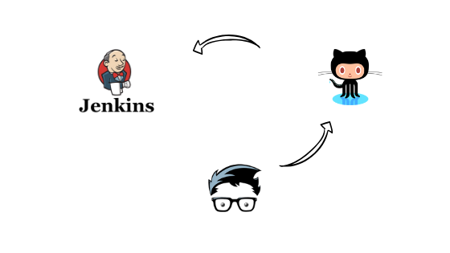

# Set up a Jenkins CI/CD pipeline with Terraform in AWS
 

## Acceptance Criteria:
1. Create Jenkins server and be able to login
2. Create instance profile to run terraform jobs
3. Create SSH key to access repo from GitHub
4. Every time a change is made to GitHub Repo and merged to Master Branch, Jenkins will run the pipeline.
---
## Prerequsites:
* Download and extract the  latest release of the Terraform. 

  - [Download Terraform - Terraform by HashiCorp](https://www.terraform.io/downloads.html)

  - Run ```unzip terraform```

* You should have an AWS account credentials. 

  - Setup IAM access key and secret on your AWS account.

  - To login to your account run on your terminal 
```aws configure```
---
## Solution
### 1. Create Jenkins server and be able to login
### 2. Create instance profile to run terraform jobs
* Clone this repo 
* Run ```terraform init```
* Run ```terraform plan```
* Run ```terraform apply```
* Login to jenkins server using IP addess given by terraform output though your terminal
### 3. Create SSH key to access repo from GitHub
* Run ```ssh-keygen```
* Run ```cat ~/.ssh/sshkeyfilename``` and copy the key
* Upload it to your github ```settings > SSH and GPG keys```
* Create a repo from where jenkins will get tasks 
### 4. Every time a change is made to GitHub Repo and merged to Master Branch, Jenkins will run the pipeline.
* Login to your Jenkins server through your browser ```IPADDR:8080```
* To get a password run ```cat /var/lib/jenkins/secrets/initialAdminPassword```
* Install suggested plugins "git plugin is included"
* Create a pipline and point it to your github repo

This code will create: 

1. provider.tf - This section sets up the provider (the plugin for terraform which tells it how to talk with a cloud provider) and the region where the resources will be created. 
2. key.tf - creates a key and stores it in the region you define in var.tf file. And it is used to connect to the created instance via ssh.
3. sg.tf - creates a security group to open ports 22, 80, 443 and 8080.
Port  22 -Secure Shell (SSH) - used for secure logins. 
Port 80-Port 80 is the port number assigned to commonly used internet *communication* protocol, Hypertext Transfer Protocol (HTTP)
Port 443-*Port 443* is mainly used by web servers providing HTTPS (HTTP encrypted by SSL or TLS)
Port 8080 - default port for jenkins.
4. data_ami.tf - This data source is used to get the ID of a registered AMI to create an EC2 instance. 
5. ec2.tf - creates an ec2 instances, logs into the instance, installs, starts and enables the jenkins using userdata.
6. role.tf - give permissions to jenkins machine to perform tasks 
7. instance profile - used to tag the IAM role to the EC2 instance
6. Output.tf - gives you a public IP of your instance.
8. Var.tf - contains variables where to create an instance, the size of an instance and private/public key to login to the instance.

